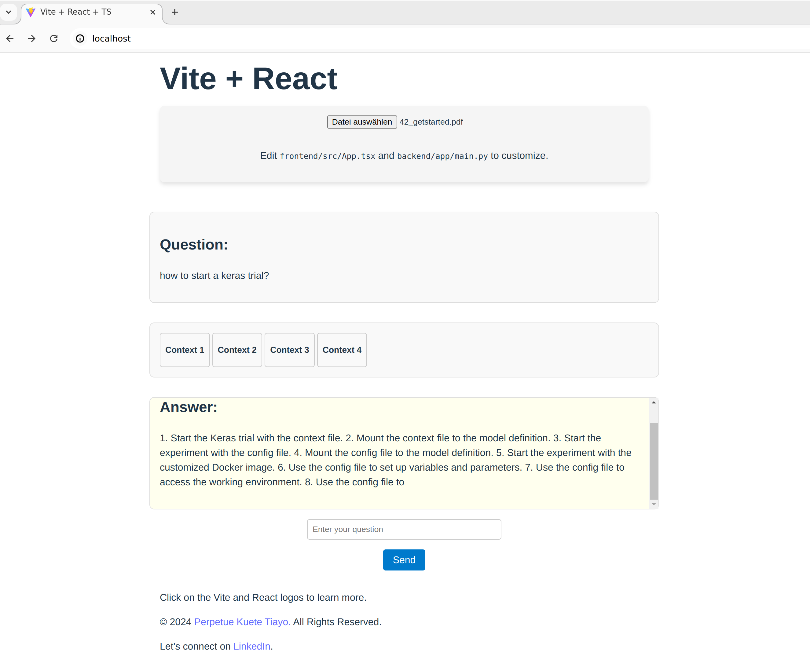

# Retrieval-Augmented Generation (RAG) API Template with Frontend and Backend
This repository proposes a template to set up and build a GPU-accelerated RAG-API FastAPI and HuggingFace Transformers.

- [Retrieval-Augmented Generation (RAG) API Template with Frontend and Backend](#retrieval-augmented-generation-rag-api-template-with-frontend-and-backend)
  - [Project Structure](#project-structure)
  - [Features](#features)
  - [Requirements](#requirements)
  - [Dependencies (tested on UBUNTU 22.04)](#dependencies-tested-on-ubuntu-2204)
  - [Installation](#installation)
    - [1. Clone the repo:](#1-clone-the-repo)
    - [2. Navigate to the project directory:](#2-navigate-to-the-project-directory)
    - [3. Sart the API:](#3-sart-the-api)
    - [4. Visit the API](#4-visit-the-api)
    - [5. Stop the Application and Clean the System](#5-stop-the-application-and-clean-the-system)
  - [Deployment](#deployment)
    - [Services with Docker Compose](#services-with-docker-compose)
    - [Nginx Configuration Overview](#nginx-configuration-overview)
  - [Contributions](#contributions)
  - [License](#license)
  - [Contact](#contact)

## Project Structure

```plaintext
|-- LICENSE
|-- README.md
|-- backend
|   |-- Dockerfile
|   |-- app
|   |-- requirements.txt
|-- docker-compose.yml
|-- frontend
|   |-- Dockerfile
|   |-- README.md
|   |-- index.html
|   |-- package-lock.json
|   |-- package.json
|   |-- public
|   |-- src
|   |-- tsconfig.app.json
|   |-- tsconfig.json
|   |-- tsconfig.node.json
|   `-- vite.config.ts
|-- install-docker.sh
|-- install-nvidia-container-toolkit.sh
|-- models_loader.ipynb
`-- nginx
    `-- nginx.conf
```
## Features

- **File Upload:** Easily upload PDF files to the server.
- **Document Loading:** Load and process documents using the langchain PyPDFLoader.
- **Text Splitting:** Split documents into manageable chunks using the CharacterTextSplitter.
- **Vector Store:** Create a FAISS vector store from document chunks for efficient retrieval.
- **Embeddings:** Use HuggingFace embeddings to transform text data.
- **Text Generation:** Generate answers to questions using a pre-trained language model.
- **Asynchronous Streaming:** Stream responses asynchronously for efficient and responsive querying.
- **Customizable Pipeline:** Easily customize the text generation pipeline with quantization and other settings.
- **CORS Support:** Full CORS support for cross-origin requests.
- **Logging:** Detailed logging for monitoring and debugging.
- **Memory Management:** Efficient GPU memory management with garbage collection.

## Requirements

- Operating System: Windows, macOS, Linux
- Minimum Disk Space: 10GB
- Minimum Memory: 4GB RAM
- GPU Characteristics: NVIDIA RTX A2000 GPU with 4096MiB total memory

## Dependencies (tested on UBUNTU 22.04) 

- NVIDIA drivers
- Visual Studio Code (optional, for development)
- Jupyter Notebook (for downloading pre-trained models)

## Installation

### 1. Clone the repo:
```sh
git clone https://github.com/Perpetue237/rag-api-template.git
```

After cloning the repository, follow these steps to set up the project:

1. Install Docker and nvidia-container-toolkit.sh

> **Note:** The execution of this shell files reboot the notebook. To avoid this you may want to comment the corresponding lines out.

Navigate to the project directory:
```sh
cd rag-api-template
```

- Docker Desktop:
    ```sh
    echo   "deb [arch="$(dpkg --print-architecture)" signed-by=/etc/apt/keyrings/docker.gpg] https://download.docker.com/linux/ubuntu lunar stable" | sudo tee /etc/apt/sources.list.d/docker.list > /dev/null
    sudo bash install-docker.sh
    ```
    Reboot the system after a succesfull installation. 

- NVIDIA Container Toolkit:
    ```sh
        sudo bash install-nvidia-container-toolkit.sh
    ```


2. Create Directories
Create directories to store the models, tokenizers, and data. You can create these directories anywhere on your file system. Here is an example of how to create them in the project's root directory:

```sh
mkdir -p ~/rag-template/models/models
mkdir -p ~/rag-template/models/tokenizers
mkdir -p ~/rag-template/rag-uploads
```

3. Update `docker-compose.yml`
Modify the [docker-compose.yml](`docker-compose.yml`) file to mount these directories:

```yaml
services:
    backend:
        ...
        volumes:
        - /home/perpetue/rag-template/models/models:/app/models  # Mount the models directory
        - /home/perpetue/rag-template/models/tokenizers:/app/tokenizers  # Mount the tokenizers directory
        - /home/perpetue/rag-template/rag-uploads:/app/rag-uploads  # Mount the uploads directory
        ...
```
Replace `/home/perpetue/rag-template` with the path where you created the directories.

4. Update `.devcontainer/devcontainer.json`
If you are using VSCode for development, you need to mount these paths in the [.devcontainer/devcontainer.json](`devcontainer.json`) file:

```json
    ...
    "mounts": [
            "source=/home/perpetue/rag-template/models/models,target=/app/models,type=bind,consistency=cached",
            "source=/home/perpetue/rag-template/models/tokenizers,target=/app/tokenizers,type=bind,consistency=cached",
            "source=/home/perpetue/rag-template/rag-uploads,target=/app/rag-uploads,type=bind,consistency=cached"
        ],
    ...
```
Replace `/home/perpetue/rag-template` with the path where you created the directories.

5. Download Pre-trained Models
Use the [models_loader.ipynb](models_loader.ipynb) notebook to download the pre-trained models you want to use. Open the notebook in Jupyter Notebook or JupyterLab and follow the instructions to download the necessary models. You can put your huggingface token and openai keys in an `.env` file in the projekt root folder, according to the sample in [.env.sample](`.env.sample`). 

### 2. Navigate to the project directory:
    ```sh
    cd rag-api-template
    ```
### 3. Sart the API:
    ```sh
    docker compose down
    docker volume prune
    docker system prune
    docker-compose up --build -d
    ```
### 4. Visit the API
Once the API is successfully built, you can visit it at [http://localhost/](http://localhost/). You should see the following frontend:

<div style="display: flex; justify-content: space-between; align-items: center;">
    
    
</div>

### 5. Stop the Application and Clean the System

```sh
docker-compose down
docker system prune
docker volume prune
```

## Deployment

This [Docker Compose file](docker-compose.yml) sets up a multi-container application with three services: `frontend`, `backend`, and `nginx`.

### Services with Docker Compose

- **Frontend Service**
  - **Build Context**: `./frontend`
  - **Port**: 80
  - **Network**: `app-network`

- **Backend Service**
  - **Build Context**: `./backend`
  - **Port**: 8000
  - **Network**: `app-network`
  - **Volumes**: Mounts local directories for models and uploads
  - **GPU Configuration**: Configured to use NVIDIA GPUs

- **Nginx Service**
  - **Image**: `nginx:latest`
  - **Port**: 8081
  - **Configuration**: Uses a custom Nginx configuration file
  - **Dependencies**: Depends on `frontend` and `backend`
  - **Network**: `app-network`


Docker Compose builds, configures, and runs the specified services in isolated containers. Services can communicate over the defined `app-network`, ensuring connectivity and proper resource allocation.

### Nginx Configuration Overview

This [Nginx configuration file](nginx/nginx.conf) sets up a basic web server with proxying capabilities and custom error handling.

- **Worker Processes**
  - `worker_processes 1;` - Uses one worker process.

- **Events**
  - `worker_connections 1024;` - Allows up to 1024 connections per worker.

- **HTTP Server**
  - **Port**
    - `listen 80;` - Listens on port 80 for HTTP requests.

  - **Server Name**
    - `server_name localhost;` - Uses `localhost` as the server name.

  - **Root Path (`/`)**
    - Serves static files from `/usr/share/nginx/html`.
    - Defaults to `index.html` and falls back to it for single-page applications.

  - **Proxy Endpoints**
    - **/upload**
      - Forwards requests to `http://backend:8000/upload`.
      - Includes CORS headers for cross-origin requests.
    - **/retrieve_from_path**
      - Forwards requests to `http://backend:8000/retrieve_from_path`.
      - Includes CORS headers.

  - **Error Handling**
    - `error_page 500 502 503 504 /50x.html;` - Custom error page for server errors.

## Contributions
Contributions are what make the open-source community such an amazing place to learn, inspire, and create. Any contributions you make are **greatly appreciated**.

1. Fork the Project
2. Create your Feature Branch (`git checkout -b feature/AmazingFeature`)
3. Commit your Changes (`git commit -m 'Add some AmazingFeature'`)
4. Push to the Branch (`git push origin feature/AmazingFeature`)
5. Open a Pull Request

## License

Distributed under the Apache License. See [LICENSE](LICENSE) for more information.

## Contact

[Perpetue Kuete Tiayo](https://www.linkedin.com/in/perpetue-k-375306185)

